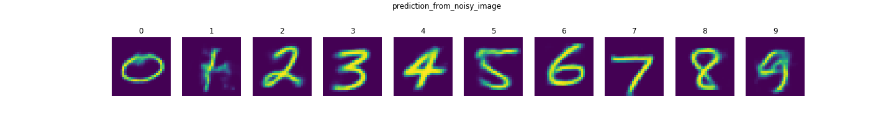

# Variational Autoencoder 

### Autoencoder 

- neural network with unsupervised machine-learning algorithm apply back-prop to set target value to the input
- auto-encoder prefers over PCA because it can learn non-linear transformations with non-linear activation functions. more efficient to learn several layer with auto-encoder then one huge transformation with PCA.

### Autoencoder Applications

- Image coloring (Black-white images -> colored)
- Feature variation (Extract required feature)
- Dimensionality Reduction
- Denosing image (Remove Noise)
- Remove watermark

### Autoencoder Architecture

- Encoder : part of NN compress the input into latent space representation
- code : part of NN represents compressed input
- Decoder : Decode the encoded data to original dimension

### Properties of Autoencoder

- Data-specific: Autoencoders are only able to meaningfully compress data similar to what they have been trained on.
- Lossy: de-compressed output will be degrad compared to the original input
- Unsupervised: Autoencoders are considered an unsupervised learning technique since they don’t need explicit labels to train on. But to be more precise they are self-supervised because they generate their own labels from the training data.

### Types of Autoencoder

1. Denoising autoencoder.
2. Sparse Autoencoder.
3. Deep Autoencoder.
4. Contractive Autoencoder.
5. Undercomplete Autoencoder.
6. Convolutional Autoencoder.
7. Variational Autoencoder.

# convolutional Variational Autoencoder (Mnist)

### Model architecture

### Generated Numbers from latent space

### Encoded Dimension of Latent space from 2 to 10

### Remove Noise and Prediction

|                        |                      **Latent space 2**                       |
| :--------------------: | :-----------------------------------------------------------: |
|  **Original Numbers**  |                  |
| **Numbers prediction** |  |
|   **Noisy Numbers**    |                     |
|    **Remove Noise**    |      |

|                        |                      **Latent space 3**                       |
| :--------------------: | :-----------------------------------------------------------: |
|  **Original Numbers**  |                  |
| **Numbers prediction** |  |
|   **Noisy Numbers**    |                     |
|    **Remove Noise**    |      |

|                        |                      **Latent space 4**                       |
| :--------------------: | :-----------------------------------------------------------: |
|  **Original Numbers**  |                  |
| **Numbers prediction** |  |
|   **Noisy Numbers**    |                     |
|    **Remove Noise**    |      |

|                        |                      **Latent space 5**                       |
| :--------------------: | :-----------------------------------------------------------: |
|  **Original Numbers**  |                  |
| **Numbers prediction** |  |
|   **Noisy Numbers**    |                     |
|    **Remove Noise**    |      |

|                        |                      **Latent space 6**                       |
| :--------------------: | :-----------------------------------------------------------: |
|  **Original Numbers**  |                  |
| **Numbers prediction** |  |
|   **Noisy Numbers**    |                     |
|    **Remove Noise**    |      |

|                        |                      **Latent space 7**                       |
| :--------------------: | :-----------------------------------------------------------: |
|  **Original Numbers**  |                  |
| **Numbers prediction** |  |
|   **Noisy Numbers**    |                     |
|    **Remove Noise**    |      |

|                        |                      **Latent space 8**                       |
| :--------------------: | :-----------------------------------------------------------: |
|  **Original Numbers**  |                  |
| **Numbers prediction** |  |
|   **Noisy Numbers**    |                     |
|    **Remove Noise**    |      |

|                        |                      **Latent space 9**                       |
| :--------------------: | :-----------------------------------------------------------: |
|  **Original Numbers**  |                  |
| **Numbers prediction** |  |
|   **Noisy Numbers**    |                     |
|    **Remove Noise**    |      |

|                        |                      **Latent space 10**                       |
| :--------------------: | :------------------------------------------------------------: |
|  **Original Numbers**  |                  |
| **Numbers prediction** |  |
|   **Noisy Numbers**    |                     |
|    **Remove Noise**    |      |
